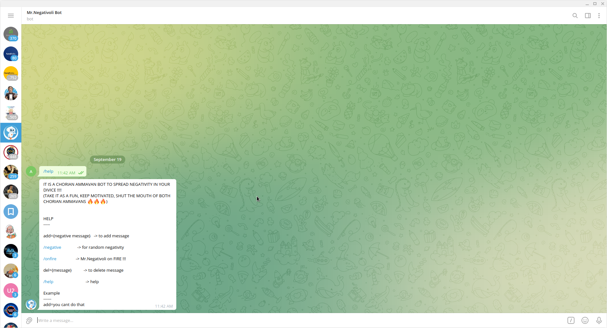
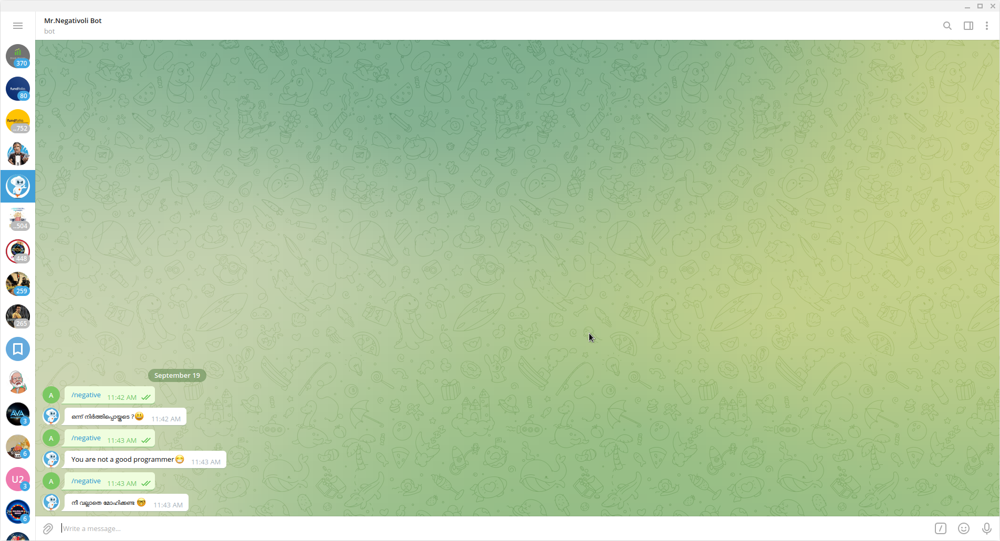
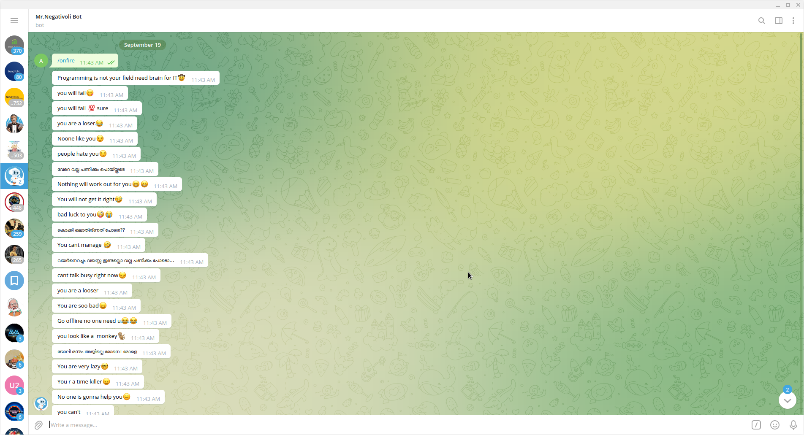

<h1 align="center">Mr.Negativoli Bot</h1>

  

    A chorian ammavan who lives in your telegram 
     

  <!-- ABOUT THE PROJECT -->
## About The Project

### Telegram Example
---

<!-- GETTING STARTED -->
Mr.Negativoli is a chorian Ammavan who can demotivate a person to atmost zero level
This chorian ammavan is purely built with python
  
  here's is why:
  1.Mr.Negativoli bot can be used to experiment how negativity affect human mentality.
  2.It shows the importance of surrounding yourself with positive people.
  3.On the otherhand,sometimes demotivations also motivate people to overcome the challenges that they face and showoff to the world their success.
  

### Built With
Here are some major frameworks that we used to built our project.
* [Python](https://www.python.org/)
* [Flask](https://flask.palletsprojects.com/)
* [Replit](https://replit.com/)
* [UptimeRobot](https://uptimerobot.com/)
* [Telegram Api](https://core.telegram.org/)

<!-- USAGE EXAMPLES -->

### Using the telegram bot

1. <a href="https://t.me/MrNegativoliBot">Click here</a> to use 'Mr.Negativoli Bot'
2. or search 'Mr.Negativoli Bot'
3. Example messages 
 
HELP
-----

-add={negative message}   -> to add message   

-/negative               -> for random negativity

-/onfire                  -> Mr.Negativoli on FIRE !!!

-del={message}           -> to delete message

-/help                              -> help

#Example
------
-add=you cant do that

## Contributers
* [Amjad CP](https://github.com/amjadcp)
* [Adil Ayyoob](https://github.com/Adilayyoob)
* [Nidha shoukhath kp](https://github.com/nidhashoukhath)
